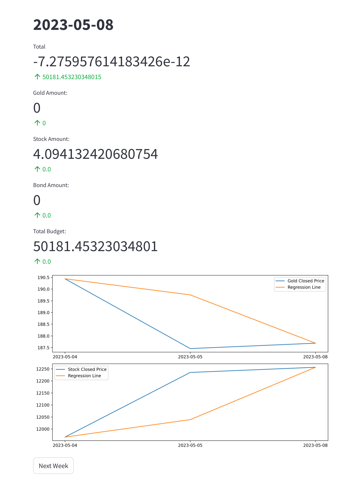

# Operation Research Project

## Overview

This project involves implementing a sequential decision-making process for investment in Gold, Stock, and Bond. The decision-making process is conducted weekly, utilizing historical data and a linear regression model for future predictions. The integration of linear programming using MiniZinc ensures interpretable objectives and constraints.

## Team Members

- Ali Maher
- [Mehdi Vakili](https://github.com/mehdivakili)

## Parts of the Project

### Part 1: Linear Regression Implementation

In this part, a linear regression model is implemented for fitting a line to the data points representing object prices and dates. Due to solver limitations in MiniZinc, challenges were faced in handling float variables and implementing absolute functions. A workaround involved using constraints to mimic the behavior of an absolute function.

### Part 2: Decision-Making with MiniZinc

The second part focuses on implementing a MiniZinc file for decision-making, optimizing the profit from investments in gold, stock, and bonds based on predicted data. Constraints are applied to ensure the accuracy of the calculated budget.

### Part 3: Data Handling and Visualization

The final part involves data handling using NumPy and Pandas, time handling with the DateTime library, connecting the prediction and decision-making parts, and showcasing results with visualizations. A Streamlit app is developed for an interactive and user-friendly display of weekly plots, decisions, and budget.

## Usage

1. Install required dependencies: `pip install -r requirements.txt`
2. Run the Streamlit app: `streamlit run main.py`

## Conclusion

The project provides insights into short-term investment strategies, suggesting the optimal time window for decision-making. The GitHub repository contains code, documentation, and visualizations for a comprehensive understanding.

